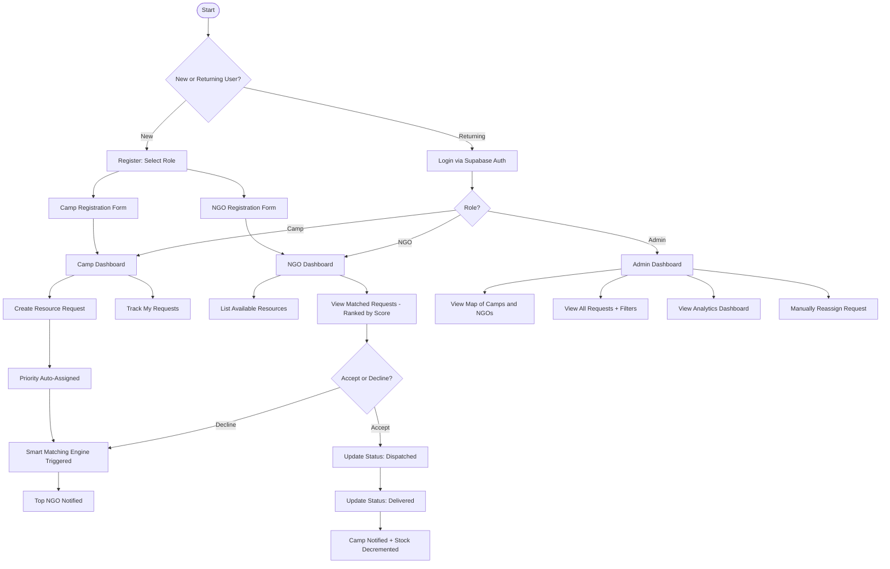
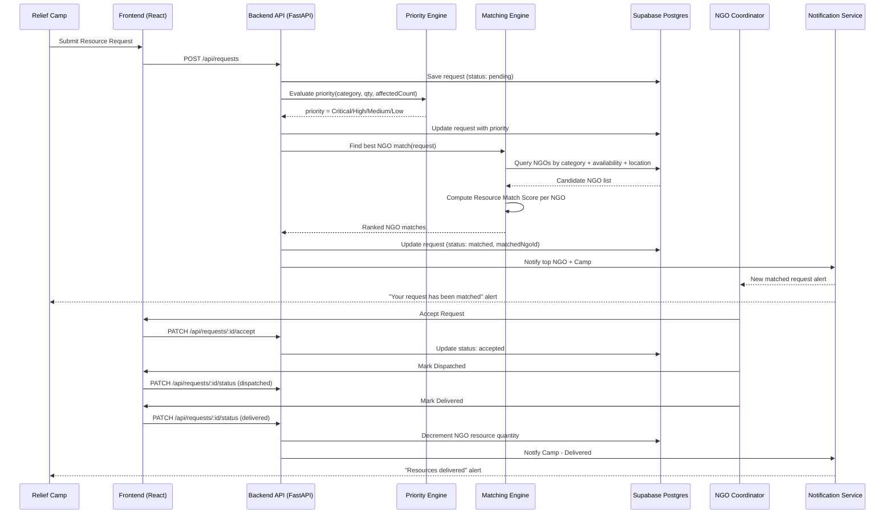
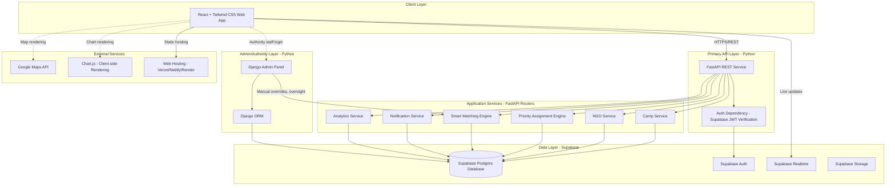
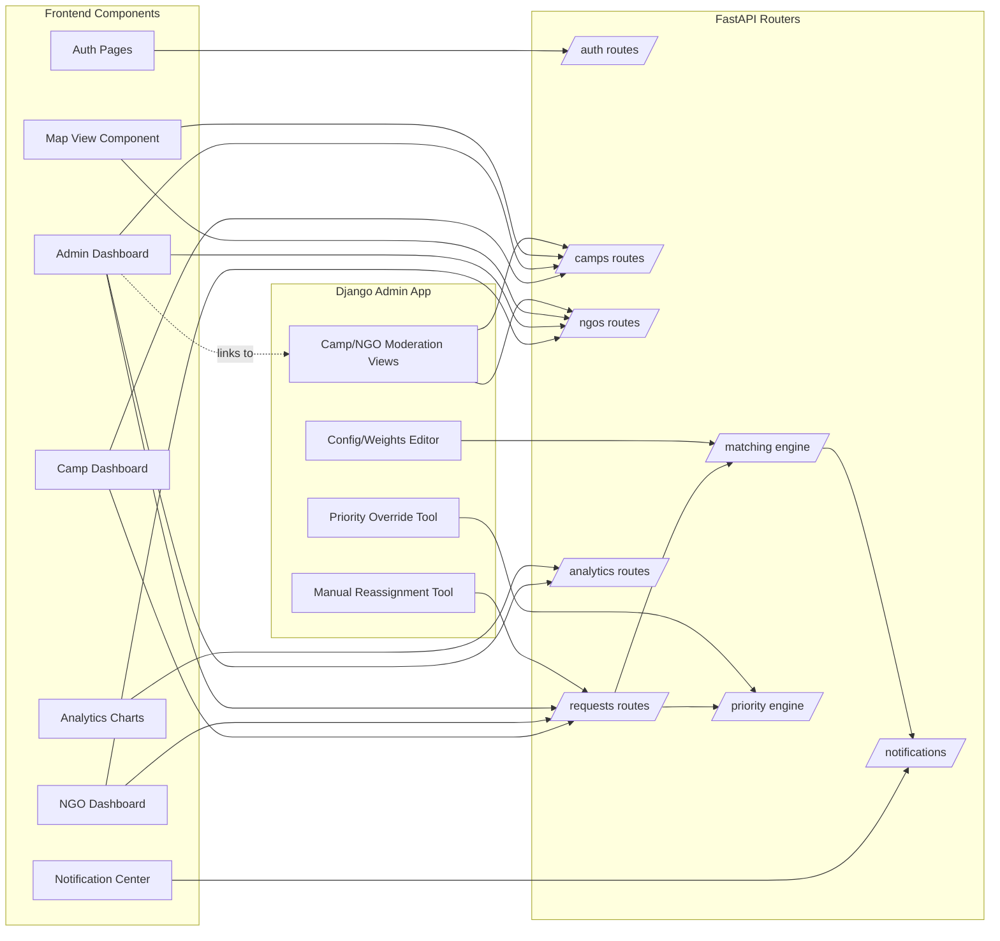
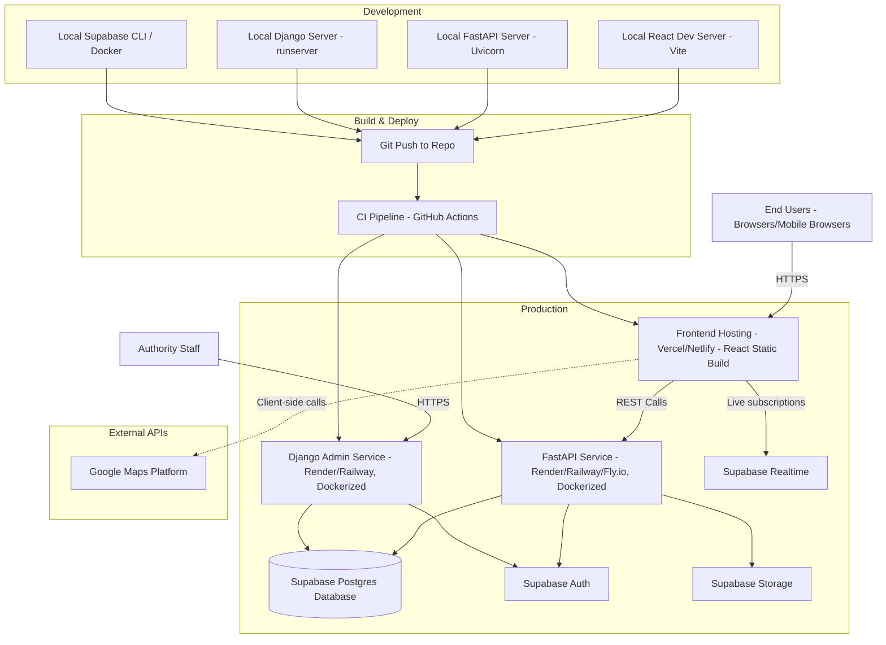
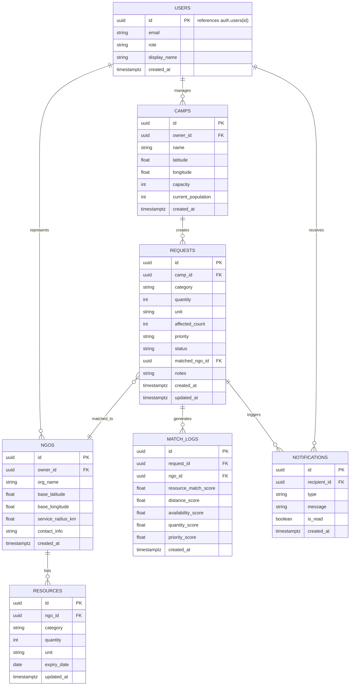

# ReliefLink
## Smart Disaster Relief Resource Coordination Platform

**Product Requirements Document (PRD)**

| | |
|---|---|
| **Document Type** | Product Requirements Document |
| **Product Name** | ReliefLink |
| **Version** | 1.1 (Hackathon MVP — Supabase/FastAPI/Django Stack) |
| **Status** | Draft — For Hackathon Submission |
| **Prepared For** | Hackathon Judges, Product Managers, Engineering Team |
| **Domain** | Disaster Relief Logistics & Coordination (Post-Disaster Phase) |

---

## Table of Contents

1. Executive Summary
2. Product Vision
3. Problem Statement
4. Objectives
5. Scope (In Scope and Out of Scope)
6. Target Users and User Personas
7. Functional Requirements
8. Non-Functional Requirements
9. User Stories
10. User Flow
11. System Workflow
12. Low-Level Feature Description
13. High-Level System Architecture
14. Database Design (ER Diagram and Collections)
15. API Design (REST APIs)
16. Technology Stack
17. Security Considerations
18. Assumptions and Constraints
19. MVP Scope for a 24-Hour Hackathon
20. Future Enhancements
21. Expected Impact
22. SDG Mapping
23. Conclusion

---

## 1. Executive Summary

ReliefLink is a centralized, web-based coordination platform designed to close the communication and logistics gap that occurs **after** a disaster strikes — during the relief distribution phase. It is explicitly **not** a prediction, early-warning, or search-and-rescue tool. Instead, it addresses a narrower but critically under-served problem: once relief camps are set up and displaced populations are sheltered, how do camp managers, NGOs, and disaster management authorities efficiently discover each other's needs and supplies, and route the right resources to the right place at the right time?

Today, this coordination largely happens through phone calls, WhatsApp groups, and spreadsheets, which do not scale during large-scale disasters and frequently result in duplicated deliveries to well-connected camps while remote or newly-established camps go unserved. ReliefLink solves this by giving Relief Camps a single place to publish resource requests, giving NGOs a single place to publish resource availability, and by running a **Smart Matching Engine** that recommends the best NGO-to-camp pairing using a weighted **Resource Match Score** (distance, availability, quantity, and priority) rather than naive nearest-neighbor matching. A **Priority Assignment Engine** automatically classifies incoming requests (Critical / High / Medium / Low) so that life-critical needs — drinking water shortages, medical supplies, and large-population camps — are never buried under lower-urgency requests.

The MVP is scoped to be buildable by a small team within a 24-hour hackathon window using a Python-centric, relational-first stack: **React + Tailwind CSS** on the frontend, **FastAPI** as the primary REST API service, **Django** powering an internal admin/authority panel (leveraging Django's built-in admin and ORM for rapid back-office tooling), **Supabase** (managed Postgres + Auth + Realtime + Storage) as the data and identity layer, **Google Maps API** for geolocation/visualization, and **Chart.js** for analytics — while the underlying architecture is designed to scale into a real-world disaster response tool post-hackathon.

---

## 2. Product Vision

> **"To ensure that no relief camp waits for help it doesn't know how to ask for, and no NGO sends aid where it isn't needed."**

ReliefLink envisions a future where disaster relief logistics are driven by real-time, structured data rather than fragmented phone calls and informal networks — where every relief camp has a digital voice, every NGO has visibility into where its resources create the most impact, and every disaster management authority has a live, data-backed view of the relief operation across a region.

---

## 3. Problem Statement

During the response phase immediately following a disaster (flood, cyclone, earthquake, etc.), relief camps are typically set up rapidly by local authorities, volunteers, or communities. These camps urgently need food, drinking water, medicines, blankets, clothing, and shelter materials. Simultaneously, NGOs and government bodies mobilize resources to help — but **the two sides frequently cannot find each other efficiently**.

Observed real-world pain points:

| Problem | Impact |
|---|---|
| No centralized channel for camps to broadcast needs | Camps rely on ad-hoc phone calls that may not reach the right NGO in time |
| No visibility into which NGOs have which resources, in what quantity, and where | NGOs duplicate effort or misallocate resources |
| No systematic prioritization of requests | A minor clothing shortage may get addressed before a critical medical supply shortage |
| No authority-level oversight of the overall relief effort | Disaster Management Authorities cannot see gaps, bottlenecks, or duplication across the region |
| Manual matching is slow and non-optimal | Nearest NGO is not always the best NGO if it lacks stock or has lower quantity available |
| Fragmented communication tools (calls, SMS, WhatsApp) | No audit trail, no analytics, no accountability |

ReliefLink directly targets this **coordination gap in the post-disaster relief distribution phase**.

---

## 4. Objectives

| # | Objective | Success Indicator |
|---|---|---|
| O1 | Provide relief camps a simple way to register and post resource requests | Camp can submit a request in under 60 seconds |
| O2 | Provide NGOs a simple way to register and post resource availability | NGO can list available resources in under 60 seconds |
| O3 | Automatically prioritize incoming requests | Every request is auto-tagged Critical/High/Medium/Low with zero manual input |
| O4 | Recommend the most suitable NGO per request using a computed score, not just proximity | Match recommendation returned in real time with a transparent score breakdown |
| O5 | Give authorities a bird's-eye operational view | Dashboard shows live camp status, request status, and fulfillment analytics |
| O6 | Keep all stakeholders informed of status changes | Notifications triggered on request creation, match, and fulfillment |
| O7 | Be demoable and functional within a 24-hour hackathon | Core flow (register → request → match → notify → fulfill) works end-to-end on a live deployment |

---

## 5. Scope

### 5.1 In Scope

- Relief Camp registration and profile management
- NGO registration and profile management
- Posting, editing, and tracking of relief resource **requests** (by camps)
- Posting, editing, and tracking of relief resource **availability** (by NGOs)
- Smart Matching Engine (Resource Match Score calculation)
- Priority Assignment Engine (rule-based classification)
- Admin/Authority Dashboard with map view and analytics
- In-app and email notifications for key status changes
- Basic authentication and role-based access (Camp / NGO / Admin)
- Analytics dashboard (requests fulfilled, pending, by category, by region)
- Location-based visualization via Google Maps

### 5.2 Out of Scope

- Disaster prediction, early warning systems, or weather forecasting
- Search-and-rescue operations or missing-person tracking
- Real-time chat/messaging between users (v1 uses status-based notifications only)
- Payment processing, donations, or financial transactions
- Inventory procurement / supply chain sourcing outside registered NGOs
- Mobile native apps (MVP is responsive web only)
- Multi-language localization (planned as a future enhancement)
- Offline-first / low-connectivity sync (planned as a future enhancement)
- Volunteer management and shift scheduling

---

## 6. Target Users and User Personas

### 6.1 User Roles

| Role | Description |
|---|---|
| **Relief Camp Manager** | Runs or represents a relief camp; posts needs, tracks fulfillment |
| **NGO Coordinator** | Represents an NGO; lists available resources, responds to matched requests |
| **Disaster Management Authority (Admin)** | Oversees the region; monitors all camps, NGOs, requests, and analytics |

### 6.2 Personas

**Persona 1 — Camp Manager "Ramesh"**
- Age 42, government school teacher turned relief camp coordinator after a flood.
- Manages a camp of ~350 displaced people with limited staff and no logistics background.
- Needs: A dead-simple way to say "we need drinking water and blankets urgently" and know help is coming.
- Pain: Currently calls 5–6 numbers hoping someone picks up.

**Persona 2 — NGO Coordinator "Divya"**
- Age 29, field coordinator for a mid-sized humanitarian NGO.
- Manages relief supply inventory across multiple trucks and warehouses.
- Needs: To know which camps need what, right now, sorted by urgency and distance, so her team isn't wasting fuel and time.
- Pain: Receives requests via scattered WhatsApp forwards with no way to verify or prioritize them.

**Persona 3 — Authority Official "Mr. Suresh Iyer"**
- Age 51, District Disaster Management Officer.
- Responsible for regional oversight and reporting to state authorities.
- Needs: A live dashboard showing which camps are under-served, which NGOs are active, and overall fulfillment rate.
- Pain: Currently compiles status reports manually from phone updates, hours behind real-time.

---

## 7. Functional Requirements

### 7.1 Authentication

| ID | Requirement |
|---|---|
| FR-AUTH-01 | Users register with email/password via Supabase Auth |
| FR-AUTH-02 | Registration requires role selection: Relief Camp / NGO / Admin |
| FR-AUTH-03 | Admin accounts are pre-provisioned/whitelisted (not self-service) for MVP |
| FR-AUTH-04 | Role-based access control (RBAC) restricts module access by role |
| FR-AUTH-05 | Password reset via Supabase Auth email flow |
| FR-AUTH-06 | Session persistence via Supabase JWT (access + refresh token) |

**Implementation Note:** Store `role` as a column on the `profiles` table (not in the JWT itself, to keep role changes immediate) and use it to drive RBAC on both React route guards and FastAPI dependency-based middleware. Django admin separately restricts access to `is_staff`/`is_superuser` accounts.

### 7.2 Relief Camp Module

| ID | Requirement |
|---|---|
| FR-CAMP-01 | Camp manager registers camp profile: name, location (lat/lng via Google Maps picker), capacity, current population |
| FR-CAMP-02 | Camp manager creates a resource request specifying: category (food/water/medicine/blankets/clothes/shelter), quantity, unit, affected people count, notes |
| FR-CAMP-03 | System auto-assigns a priority label to each request (see Priority Rules, Section 12) |
| FR-CAMP-04 | Camp manager views status of all submitted requests: Pending / Matched / In-Transit / Fulfilled |
| FR-CAMP-05 | Camp manager can edit or cancel a request while still Pending |
| FR-CAMP-06 | Camp manager sees which NGO has been matched to a fulfilled/in-progress request |

### 7.3 NGO Module

| ID | Requirement |
|---|---|
| FR-NGO-01 | NGO registers profile: organization name, base location, service radius, contact info |
| FR-NGO-02 | NGO lists available resources: category, quantity, unit, expiry (for perishables/medicines), location of stock |
| FR-NGO-03 | NGO views incoming matched requests ranked by Resource Match Score |
| FR-NGO-04 | NGO accepts or declines a matched request |
| FR-NGO-05 | On acceptance, NGO updates status: Accepted → Dispatched → Delivered |
| FR-NGO-06 | On delivery confirmation, system decrements NGO's available resource quantity automatically |

### 7.4 Admin Dashboard

| ID | Requirement |
|---|---|
| FR-ADM-01 | Admin views all registered camps and NGOs on an interactive Google Map |
| FR-ADM-02 | Admin views all requests with filters: status, priority, category, region |
| FR-ADM-03 | Admin can manually reassign a request to a different NGO if needed |
| FR-ADM-04 | Admin views system-wide analytics (see Section 7.8) |
| FR-ADM-05 | Admin can flag/deactivate suspicious or duplicate camp/NGO accounts |
| FR-ADM-06 | Admin can export a status report (CSV/JSON) — stretch goal |

**Implementation Note:** The map-and-analytics view (FR-ADM-01, FR-ADM-02, FR-ADM-04) is built into the main **React** app as the public-facing authority dashboard. The moderation and override actions (FR-ADM-03, FR-ADM-05, FR-ADM-06) are implemented via **Django's built-in admin interface**, which is the fastest way to get a working CRUD/moderation back-office running within the hackathon window without hand-building admin UI screens. Django connects to the same Supabase Postgres database as FastAPI (using `psycopg2`/Django's ORM against the Supabase connection string).

### 7.5 Smart Matching Engine

| ID | Requirement |
|---|---|
| FR-MATCH-01 | On new request creation, engine queries all NGOs with matching resource category and available quantity > 0 |
| FR-MATCH-02 | Engine computes a **Resource Match Score** per candidate NGO (formula in Section 12.1) |
| FR-MATCH-03 | Engine returns ranked list of top-N NGO matches (default N=3) to the requester and top match auto-notified |
| FR-MATCH-04 | Engine re-runs matching if the top-matched NGO declines the request |
| FR-MATCH-05 | Matching runs synchronously on request creation for MVP (near real-time, <2s) |

### 7.6 Priority Assignment Engine

| ID | Requirement |
|---|---|
| FR-PRI-01 | Engine assigns priority automatically based on rule table (Section 12.2) at request creation time |
| FR-PRI-02 | Priority can be one of: Critical, High, Medium, Low |
| FR-PRI-03 | Admin can manually override an auto-assigned priority with justification notes |
| FR-PRI-04 | Requests are sorted by priority (then by score, then by recency) in all list views by default |

### 7.7 Notification System

| ID | Requirement |
|---|---|
| FR-NOTIF-01 | Camp receives notification when a request is matched to an NGO |
| FR-NOTIF-02 | NGO receives notification when a new request is matched to them |
| FR-NOTIF-03 | Camp receives notification when status changes (Dispatched/Delivered) |
| FR-NOTIF-04 | Admin receives notification for Critical-priority requests unmatched after a configurable threshold (e.g., 15 minutes) |
| FR-NOTIF-05 | MVP implements in-app notification center (bell icon + list) via Supabase Realtime; email notification is a stretch goal via Supabase Auth email hooks or a transactional email provider |

### 7.8 Analytics Dashboard

| ID | Requirement |
|---|---|
| FR-ANLY-01 | Total requests by status (Pending/Matched/In-Transit/Fulfilled) — pie/donut chart |
| FR-ANLY-02 | Requests by priority — bar chart |
| FR-ANLY-03 | Requests by resource category — bar chart |
| FR-ANLY-04 | Average time-to-match and time-to-fulfillment — KPI cards |
| FR-ANLY-05 | Top-performing NGOs by fulfilled requests — leaderboard table |
| FR-ANLY-06 | Regional heat-map of unmet demand (stretch goal) |

---

## 8. Non-Functional Requirements

| Category | Requirement |
|---|---|
| **Performance** | Matching Engine must return results within 2 seconds for up to 500 concurrent NGO records |
| **Scalability** | Supabase Postgres schema must support horizontal growth in camps/NGOs/requests via proper indexing without redesign |
| **Availability** | Target 99% uptime across frontend hosting, FastAPI, Django, and Supabase during demo/operation window |
| **Usability** | Camp managers with minimal technical literacy must be able to submit a request in ≤3 form fields + 1 submit action |
| **Reliability** | No data loss on request submission; writes confirmed before UI shows success |
| **Security** | All data in transit encrypted via HTTPS; Supabase Row Level Security (RLS) policies enforce role-based read/write at the database layer |
| **Maintainability** | Modular REST API design; environment-config-driven deployment |
| **Accessibility** | WCAG 2.1 AA color contrast targets on critical UI (priority badges, alerts) |
| **Portability** | Fully responsive UI (mobile/tablet/desktop) since field coordinators primarily use phones |
| **Auditability** | All status transitions logged with timestamp and actor for traceability |

---

## 9. User Stories

| ID | As a... | I want to... | So that... |
|---|---|---|---|
| US-01 | Camp Manager | register my relief camp with location and population | authorities and NGOs know I exist and can find me |
| US-02 | Camp Manager | submit a request for drinking water | my camp's urgent need is visible to nearby NGOs immediately |
| US-03 | Camp Manager | see the status of my request update in real time | I know when to expect help |
| US-04 | NGO Coordinator | list the resources I currently have available | camps requesting matching resources can be routed to me |
| US-05 | NGO Coordinator | see requests ranked by a match score, not just distance | I can prioritize where my limited stock has the most impact |
| US-06 | NGO Coordinator | accept or decline a matched request | I stay in control of my logistics capacity |
| US-07 | Admin | view all camps and NGOs on a live map | I get a real-time operational picture of the disaster zone |
| US-08 | Admin | see analytics on fulfillment rates | I can report progress to higher authorities |
| US-09 | Admin | manually reassign a stuck request | critical needs are never left unresolved due to a single NGO's inaction |
| US-10 | Any User | receive a notification when something relevant to me changes | I don't have to constantly refresh the app |

---

## 10. User Flow



---

## 11. System Workflow



---

## 12. Low-Level Feature Description

### 12.1 Smart Matching Engine — Resource Match Score

Rather than routing every request to the geographically nearest NGO, ReliefLink computes a weighted **Resource Match Score (RMS)** per candidate NGO so that distance is balanced against actual capacity to help.

**Formula:**

```
RMS = (W1 × DistanceScore) + (W2 × AvailabilityScore) + (W3 × QuantityScore) + (W4 × PriorityAlignmentScore)
```

| Component | Description | Weight (default) |
|---|---|---|
| **DistanceScore** | `1 - (distance_km / max_service_radius_km)`, clamped to [0,1]. Closer NGOs score higher. | W1 = 0.35 |
| **AvailabilityScore** | 1 if NGO has the exact requested category in stock, 0.5 if a substitutable category exists, 0 otherwise | W2 = 0.25 |
| **QuantityScore** | `min(NGO_available_qty / requested_qty, 1)`. Rewards NGOs who can fully satisfy the request. | W3 = 0.25 |
| **PriorityAlignmentScore** | 1 if NGO has historically fulfilled this priority tier quickly (avg fulfillment time below regional median), else 0.5 | W4 = 0.15 |

- Weights are configurable per deployment (stored in a `config` collection) so authorities can tune behavior (e.g., prioritize distance more in fuel-scarce regions).
- All candidate NGOs are scored and sorted descending; top 3 are surfaced, and the top 1 is auto-notified.
- **Distance calculation** uses the Haversine formula on stored lat/lng (Google Maps Distance Matrix API optional upgrade for real road-distance/ETA).

**Implementation Note:** For the 24-hour MVP, compute RMS synchronously inside a FastAPI route handler using plain Python (no external ML dependency needed) — this keeps the demo deterministic and explainable, which also helps judges understand *why* a match was made.

### 12.2 Priority Assignment Engine — Rule Table

| Priority | Trigger Conditions (any match) |
|---|---|
| **Critical** | Category = Drinking Water AND requested qty indicates shortage (e.g., <1 day supply for affected count) · OR Category = Medicines · OR Affected people count ≥ configurable threshold (default 200) |
| **High** | Category = Food · OR Category = Shelter Materials |
| **Medium** | Category = Blankets · OR Category = Clothes |
| **Low** | Any other/miscellaneous supply category |

- Rule evaluation is a simple deterministic decision tree (if/else chain) — intentionally rule-based, not ML-based, for MVP explainability and reliability in life-safety contexts.
- Rules are stored as data (JSON config) rather than hardcoded, so authorities can adjust thresholds without a code deploy.
- Admin override always takes precedence and is logged with a mandatory justification field.

### 12.3 Status Lifecycle (Request)

```
Pending → Matched → Accepted → Dispatched → Delivered
                 ↘ Declined → (Re-matched)
Pending → Cancelled (by Camp, only while Pending)
```

---

## 13. High-Level System Architecture



### 13.1 Component Diagram



### 13.2 Deployment Architecture



**Implementation Note:** For a 24-hour hackathon, containerize FastAPI and Django as two small services (or run Django admin as a secondary process if time is short) and deploy both to a single Render/Railway project alongside the Supabase-hosted Postgres instance. The React frontend deploys independently to Vercel/Netlify. This keeps the demo to three deploy targets (frontend, FastAPI, Django) plus the managed Supabase backend, all wireable in well under an hour once code is ready.

---

## 14. Database Design (ER Diagram and Tables)

Supabase provides a fully managed **Postgres** database, so ReliefLink uses a proper relational schema with foreign keys and constraints (a natural fit, since the domain — camps, NGOs, requests, matches — is inherently relational). The ER diagram below maps directly to actual Postgres tables, enforced with foreign key constraints and Supabase **Row Level Security (RLS)** policies.



### 14.1 Supabase Postgres Table Summary

| Table | Purpose | Key Columns |
|---|---|---|
| `profiles` | App-level user profile, 1:1 with Supabase `auth.users` | `id (FK to auth.users)`, `role`, `email` |
| `camps` | Relief camp profiles | `owner_id`, `latitude`, `longitude`, `capacity`, `current_population` |
| `ngos` | NGO profiles | `owner_id`, `base_latitude`, `base_longitude`, `service_radius_km` |
| `resources` | NGO resource inventory | `ngo_id`, `category`, `quantity` |
| `requests` | Camp resource requests | `camp_id`, `category`, `priority`, `status`, `matched_ngo_id` |
| `match_logs` | Audit trail of scoring per match | `request_id`, `ngo_id`, `resource_match_score` |
| `notifications` | User notification feed | `recipient_id`, `type`, `is_read` |
| `config` | Tunable weights/thresholds (single-row or key-value table) | `matching_weights (jsonb)`, `priority_thresholds (jsonb)` |

**Implementation Notes:**
- `profiles.id` is a foreign key to Supabase's built-in `auth.users(id)`, keeping Supabase Auth as the single source of identity truth while `profiles` carries app-specific fields (`role`, `display_name`).
- Add a Postgres composite index on `requests (status, priority, created_at DESC)` to keep dashboard queries fast as request volume grows.
- Enable the `postgis` extension if the team has time to upgrade `latitude`/`longitude` pairs to a `geography(Point)` column — this allows using Postgres's native `ST_DistanceSphere` for distance calculation instead of computing Haversine in application code. For the 24-hour MVP, plain `float` lat/lng columns with Haversine in FastAPI is simpler and sufficient.
- Supabase **Row Level Security (RLS)** is enabled on every table; policies restrict `INSERT`/`UPDATE` to resource owners (`owner_id = auth.uid()`) and `SELECT` according to role (see Section 17).
- Supabase **Realtime** (Postgres logical replication) is used to push live updates to the `requests` and `notifications` tables directly to the React frontend, reducing the need for polling.

---

## 15. API Design (REST APIs)

### 15.1 Authentication

| Method | Endpoint | Description | Access |
|---|---|---|---|
| POST | `/api/auth/register` | Create `profiles` row with role after Supabase Auth sign-up | Public |
| POST | `/api/auth/login` | Login handled client-side via `supabase-js`; FastAPI only verifies the resulting JWT on subsequent calls | Public |
| GET | `/api/auth/me` | Get current user profile (joins `auth.users` + `profiles`) | Authenticated |

### 15.2 Camps

| Method | Endpoint | Description | Access |
|---|---|---|---|
| POST | `/api/camps` | Create camp profile | Camp role |
| GET | `/api/camps` | List all camps (with filters) | Admin, NGO |
| GET | `/api/camps/:id` | Get camp details | Authenticated |
| PATCH | `/api/camps/:id` | Update camp profile | Camp owner, Admin |

### 15.3 NGOs

| Method | Endpoint | Description | Access |
|---|---|---|---|
| POST | `/api/ngos` | Create NGO profile | NGO role |
| GET | `/api/ngos` | List all NGOs (with filters) | Admin, Camp |
| GET | `/api/ngos/:id` | Get NGO details | Authenticated |
| PATCH | `/api/ngos/:id` | Update NGO profile | NGO owner, Admin |
| POST | `/api/ngos/:id/resources` | Add/update resource listing | NGO owner |
| GET | `/api/ngos/:id/resources` | List NGO's resources | Authenticated |

### 15.4 Requests

| Method | Endpoint | Description | Access |
|---|---|---|---|
| POST | `/api/requests` | Create new resource request (triggers Priority + Matching engines) | Camp owner |
| GET | `/api/requests` | List requests (filterable by status/priority/category/region) | Authenticated |
| GET | `/api/requests/:id` | Get request detail incl. match log | Authenticated |
| PATCH | `/api/requests/:id` | Edit request (only while Pending) | Camp owner |
| DELETE | `/api/requests/:id` | Cancel request (only while Pending) | Camp owner |
| PATCH | `/api/requests/:id/accept` | NGO accepts matched request | Matched NGO |
| PATCH | `/api/requests/:id/decline` | NGO declines; triggers re-match | Matched NGO |
| PATCH | `/api/requests/:id/status` | Update status (dispatched/delivered) | Matched NGO |
| PATCH | `/api/requests/:id/reassign` | Admin manually reassigns to a different NGO | Admin |

### 15.5 Matching Engine

| Method | Endpoint | Description | Access |
|---|---|---|---|
| GET | `/api/requests/:id/matches` | Get ranked NGO match candidates + scores | Camp owner, Admin |
| POST | `/api/requests/:id/rematch` | Force re-run of matching algorithm | Admin |

### 15.6 Notifications

| Method | Endpoint | Description | Access |
|---|---|---|---|
| GET | `/api/notifications` | Get current user's notifications | Authenticated |
| PATCH | `/api/notifications/:id/read` | Mark notification as read | Authenticated |

### 15.7 Analytics

| Method | Endpoint | Description | Access |
|---|---|---|---|
| GET | `/api/analytics/overview` | Summary KPIs (totals by status/priority) | Admin |
| GET | `/api/analytics/ngo-leaderboard` | Top NGOs by fulfilled requests | Admin |
| GET | `/api/analytics/timeseries` | Requests over time | Admin |

**Sample Request/Response — Create Request:**

```http
POST /api/requests
Authorization: Bearer <supabase_access_token>
Content-Type: application/json

{
  "campId": "camp_123",
  "category": "drinking_water",
  "quantity": 500,
  "unit": "liters",
  "affectedCount": 320,
  "notes": "Camp water tank contaminated after flooding"
}
```

```json
{
  "requestId": "req_9f21",
  "status": "matched",
  "priority": "Critical",
  "matchedNgoId": "ngo_54",
  "resourceMatchScore": 0.87,
  "createdAt": "2026-08-06T09:15:00Z"
}
```

---

## 16. Technology Stack

| Layer | Technology | Rationale |
|---|---|---|
| Frontend | React.js (JavaScript) + Tailwind CSS | Fast component-driven UI development, rapid utility-first styling for hackathon speed |
| Primary Backend API | Python + FastAPI | Async-first, auto-generated OpenAPI docs (`/docs`), strong typing via Pydantic — ideal for the Matching/Priority engines' numeric logic |
| Admin/Authority Backend | Python + Django (Django Admin) | Batteries-included admin interface gives authorities a working back-office (moderation, manual reassignment, config editing) with minimal custom UI code |
| Database | Supabase (managed Postgres) | Real relational schema with foreign keys/constraints, fits the camps↔NGOs↔requests domain naturally; generous free tier |
| Authentication | Supabase Auth | Drop-in email/password + JWT-based auth; issues tokens verified independently by both FastAPI and Django |
| Realtime Updates | Supabase Realtime (Postgres logical replication) | Live status/notification updates pushed to React without custom WebSocket code |
| File Storage (stretch) | Supabase Storage | For camp/NGO photo uploads or proof-of-delivery images, if time allows |
| Maps | Google Maps API (Maps JavaScript API + Geocoding) | Visualize camps/NGOs, compute distances |
| Charts | Chart.js | Lightweight, fast to integrate analytics visualizations |
| Deployment | Vercel/Netlify (frontend) + Render/Railway (FastAPI + Django, Dockerized) + Supabase (managed DB/Auth) | Clean separation of concerns, each service independently deployable; free/hobby tiers sufficient for hackathon demo |
| Notifications (MVP) | Supabase Realtime subscription + in-app UI | No external notification service dependency needed for demo |

---

## 17. Security Considerations

| Area | Measure |
|---|---|
| **Authentication** | Supabase Auth issues signed JWTs (hashed credentials at rest); FastAPI verifies tokens on every protected route via a dependency (`Depends(get_current_user)`) that validates the Supabase JWT signature/expiry |
| **Authorization** | Supabase **Row Level Security (RLS)** policies enforce role- and ownership-based access directly at the Postgres level (`owner_id = auth.uid()`), so protection holds even if a client bypasses the API layer |
| **Data in Transit** | HTTPS enforced across the React app, FastAPI, Django, and Supabase endpoints by default on all target hosting providers |
| **Input Validation** | FastAPI request/response models defined with **Pydantic** provide automatic schema validation and rejects malformed payloads before they reach business logic |
| **Rate Limiting** | Basic per-IP rate limiting (e.g., `slowapi` for FastAPI) on the request-creation endpoint to prevent spam/duplicate submissions |
| **Least Privilege** | RLS policies ensure NGOs cannot query other NGOs' raw contact/resource rows beyond what's needed for matching transparency; Django admin access is restricted to authenticated Authority/Admin accounts only |
| **Admin Panel Hardening** | Django admin path is not the default `/admin/` in production, protected by Django's session auth plus a Supabase-role check, and only exposed to authority staff (not public internet by default, or IP-restricted) |
| **Audit Trail** | `match_logs` table and `updated_at` timestamps provide traceability for every request's lifecycle; Django admin's built-in `LogEntry` model additionally logs every manual admin action |
| **PII Minimization** | Only essential contact info collected; no sensitive personal data of displaced individuals is stored |
| **Admin Overrides** | All manual overrides (priority, reassignment) performed via the Django admin panel require a logged justification note tied to the admin's user ID |
| **Secrets Management** | Supabase service-role key (used only by trusted backend services, never the frontend) stored as an environment variable, never committed to source control |

---

## 18. Assumptions and Constraints

**Assumptions**
- Relief camps and NGOs have at least intermittent internet access (via field staff phones) to interact with the platform.
- Camp/NGO location data is reasonably accurate (self-reported lat/lng or address geocoded via Google Maps).
- Initial rollout targets a single district/region per deployment instance for the hackathon demo.
- Users are literate enough to fill a simple web form; UI will minimize typing via dropdowns/pickers.

**Constraints**
- 24-hour hackathon build window limits scope to core coordination flow only (see Section 19).
- Supabase free-tier project limits (database size, monthly active users, concurrent Realtime connections) during demo — acceptable for hackathon judging, would require a paid Supabase plan for real deployment.
- Google Maps API requires an API key with billing enabled for production use beyond free quota.
- No dedicated DevOps/SRE support — reliability depends on Supabase's managed Postgres infrastructure and the chosen hosting provider (Vercel/Render/Railway) for FastAPI and Django.

---

## 19. MVP Scope for a 24-Hour Hackathon

### 19.1 Must-Have (Build in first ~16 hours)

| Feature | Notes |
|---|---|
| Supabase Auth (email/password) + role selection | Camp / NGO / Admin, stored in `profiles.role` |
| Camp registration + request creation form (React + Tailwind) | With Google Maps location picker |
| NGO registration + resource listing form (React + Tailwind) | Simple quantity/category inputs |
| FastAPI service with Priority Assignment Engine (rule-based) | Deterministic, no ML needed |
| FastAPI Smart Matching Engine (Resource Match Score) | Synchronous calculation on request creation |
| Camp/NGO request status views | Pending → Matched → Dispatched → Delivered |
| React authority dashboard: map + request list + basic analytics | Chart.js pie/bar charts |
| Django admin panel: camp/NGO moderation + manual reassignment | Stood up quickly via Django's auto-generated admin views over the shared Supabase schema |
| In-app notification center | Supabase Realtime subscription-driven |

### 19.2 Nice-to-Have (Build if time remains, hours ~16–22)

- Manual admin reassignment of requests (Django admin custom action)
- NGO leaderboard analytics
- CSV export of requests (Django admin has this built-in via `django-import-export` or a simple custom action)
- Configurable matching weights via the `config` table, editable from Django admin

### 19.3 Explicitly Deferred (Do Not Build During Hackathon)

- Email notifications (Supabase Auth supports email triggers; wiring transactional emails for status changes is deferred)
- Real road-distance via Google Distance Matrix API (use Haversine on `latitude`/`longitude` for MVP)
- PostGIS-based geospatial queries (plain lat/lng + Haversine is sufficient for MVP scale)
- Multi-language support
- Offline sync / PWA capabilities
- Native mobile apps

### 19.4 Demo Script (Judging Walkthrough)

1. Register a Camp → submit a Critical-priority drinking water request.
2. Register 2 NGOs with differing distance/stock → show Matching Engine picks the NGO with the higher Resource Match Score, not just the nearest one.
3. NGO accepts → updates status through Dispatched → Delivered.
4. Camp sees real-time status updates + notification.
5. Admin dashboard shows the full picture: map, live request table, and analytics charts updating in real time.

---

## 20. Future Enhancements

| Enhancement | Value |
|---|---|
| ML-based demand forecasting per camp (based on population trends) | Proactively flag camps likely to run short before they even request |
| Offline-first PWA with background sync | Usable in low-connectivity disaster zones |
| SMS/IVR-based request submission | Reach camp managers without smartphones |
| Multi-language and voice input support | Accessibility across diverse regions |
| Google Distance Matrix / live traffic-aware ETA | More accurate DistanceScore and delivery time estimates |
| Volunteer and transport fleet management module | End-to-end logistics, not just matching |
| Donor/CSR integration for funding transparency | Broader ecosystem value, accountability reporting |
| Blockchain-based audit trail for high-value resource transfers | Tamper-proof accountability for large-scale operations |
| Integration with government disaster management systems (e.g., NDMA APIs) | Official interoperability |
| Real-time chat between matched Camp and NGO | Faster clarification on ground-level logistics |

---

## 21. Expected Impact

- **Faster response times:** Automated matching reduces the time between a camp's need being raised and an NGO being alerted from hours (manual calling) to seconds.
- **Reduced duplication and waste:** Centralized visibility prevents multiple NGOs from unknowingly targeting the same well-connected camp while others go unserved.
- **Better prioritization of life-critical needs:** Rule-based priority ensures water and medical shortages are never buried under lower-urgency requests.
- **Data-driven accountability:** Authorities gain a live, auditable record of relief distribution instead of fragmented anecdotal updates.
- **Scalable coordination model:** A single lightweight platform can extend from a single district pilot to state/national-level disaster response infrastructure.

---

## 22. SDG Mapping

| SDG | Goal | ReliefLink's Contribution |
|---|---|---|
| **SDG 1** | No Poverty | Faster, more efficient aid delivery reduces prolonged hardship for displaced populations |
| **SDG 2** | Zero Hunger | Prioritized, matched food distribution reduces food-access gaps in relief camps |
| **SDG 3** | Good Health and Well-Being | Critical-priority routing of medical supplies and drinking water reduces health risks post-disaster |
| **SDG 6** | Clean Water and Sanitation | Drinking water shortages are auto-flagged Critical and matched fastest |
| **SDG 11** | Sustainable Cities and Communities | Strengthens local disaster resilience and post-disaster recovery coordination |
| **SDG 17** | Partnerships for the Goals | Creates a shared digital coordination layer between government authorities, NGOs, and communities |

---

## 23. Conclusion

ReliefLink addresses a real, well-scoped, and often-overlooked gap in disaster response: not the moment of the disaster itself, but the critical hours and days after, when relief camps and NGOs struggle to find and coordinate with each other efficiently. By combining a rule-based Priority Assignment Engine with a transparent, weighted Smart Matching Engine, ReliefLink moves relief coordination away from ad-hoc phone calls and toward a structured, auditable, data-driven process — without requiring complex machine learning infrastructure that would be infeasible to build reliably in 24 hours.

The proposed architecture is intentionally lightweight (React + Tailwind CSS, FastAPI, Django, Supabase) to be achievable within a hackathon timeframe, while remaining structured enough — clean REST API boundaries, a normalized Postgres schema, a working admin back-office out of the box via Django, and a configurable rules/weights engine — to evolve into a genuine startup MVP or a real deployment tool for disaster management authorities. ReliefLink's core value proposition is simple: **make sure help finds need, fast, and intelligently.**

---

*End of Document*
